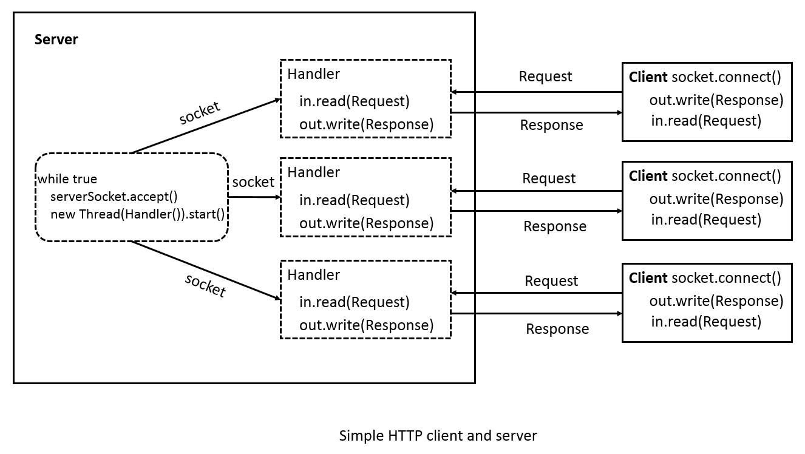

#SimpleHttpCS

HTTP客户端和服务器端的简单实现，计算机网络的实验作业。

## 实验要求

The purpose of this exercise is to build a simple Web client and a simple Web server—a server that responds only to the HTTP GET and PUT commands.
There are five steps for us to implement such a experiment:

1. Practice Manual HTTP Transactions
2. Build a simple HTTP/1.0 Client with a Command Line Interface
3. Build a simple HTTP/1.0 Server
4. Modify simple Web Server to accpt multiple,Concurrent Connections
5. Describe the differences between HTTP/1.0 and HTTP/1.1

## 实验环境

1. JDK 1.8
2. IntelliJ IDEA 15.0.2

## 项目简介

本实验项目包含两个模块:``` server ```和``` client ```，分别简单模拟了HTTP服务器和客户端。

两个模块通过socket api建立TCP连接通信。通信内容是自定义的Request和Response对象。其中封装了HTTP请求和响应报文。

基本思路是，server先开启监听端口9999。客户端开启后，等待从控制台读取输入，然后根据输入构造Request对象，之后通过socket连接服务器，再通过``` ObjectOutputStream.writeObject() ```写出Request对象。服务端监听到新的连接即开启新的Handler线程来进行处理。在Handler中使用``` ObjectInputStream.readObject() ```读入Request对象，做相应处理，然后构造Response对象，通过``` ObjectOutputStream.writeObject() ```写出。客户端再通过``` ObjectInputStream.readObject() ```读取Response对象后，关闭连接。一次完整的请求完成。



## 测试试用

### 开启服务器
``` java -jar server.jar ``` (在out/artifacts/client_jar目录下)

使用``` Ctrl+c ```或者直接关闭程序退出

### 开启客户端
``` java -jar client.jar ``` (在out/artifacts/server_jar目录下)

输入``` GET /example/uri ```模拟请求

输入``` quit ```退出客户端